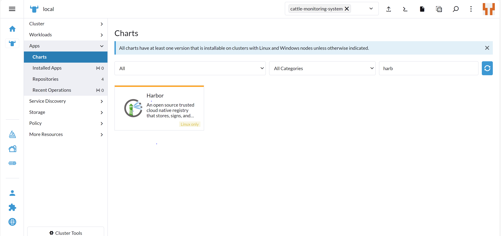

# Guida all'Installazione di Harbor su Kubernetes

## Prerequisiti

- Rancher installato
- Cluster Kubernetes versione 1.20+
- Helm versione 3.2.0+

## Installazione

1. Apri il menu principale (icona a forma di testa di toro).
2. Vai su `apps` --> `charts` e cerca `harbor` nella barra di ricerca.


3. Aggiungi il repository Helm se non è già stato aggiunto con il seguente comando come suggerito da harbor stesso:
   ```sh
   helm repo add harbor https://helm.goharbor.io
   helm repo update
   ```
4. Clicca sul pulsante verde in alto a destra con scritto `installa`.
5. Scegli il namespace in cui vuoi installare Harbor.
6. Modifica il file YAML per cambiare le password, se necessario, altrimenti lascia le password di default.
7. Elimina le regole relative al proxy come suggerito dall'immagine.
8. Clicca su `installa` per continuare.
   > **Nota:** Se il pod `harbor-core` non viene avviato, esegui un aggiornamento in caso di fallimento.

## Modifica Ingress

1. Apri la tendina con tutte le opzioni.
2. Vai su `Service Discovery` --> `Ingress`.
3. Modifica l'ingress di Harbor, premendo i tre puntini accanto a `harbor` e poi `edit YAML`.
4. Modifica il file sostituendo `core.harbor.domain` con `kube-node-2.kg.kireygroup.com`.
5. In caso di errore di mancata versione, aggiungi il campo `resourceVersion` trovando il numero nel cluster o inserendo un numero simile a quello nell'immagine.
6. Salva e visualizza il registry premendo sul link vicino alla voce `portal` nel menu degli ingress.
   > **Nota:** Assicurati di utilizzare `https` e non `http` per accedere al registry, altrimenti non riuscirai ad accedere a causa di credenziali errate.

## Aggiunta Certificati e File Daemon per il Registro

1. Prima di accedere da terminale, installa i certificati nelle apposite cartelle.
2. I certificati possono essere trovati dentro Harbor:
   - Quando crei un progetto, premi su questo e in alto a destra apparirà la possibilità di scaricare il certificato.
3. Inserisci il certificato nella cartella `/etc/docker/hostnamediharbor/` (dove `hostnamediharbor` è il nome host di Harbor, esclusa la parte `https`).
4. Vai nella cartella `/etc/docker` e crea un file `daemon.json` con il seguente contenuto:
   ```json
   {
     "insecure-registries": ["https://hostnameharbor.com"]
   }
   ```
5. Salva il file e riavvia il demone Docker:
   ```sh
   sudo systemctl restart docker
   ```
6. Dopo il riavvio, effettua il login su Harbor:
   ```sh
   docker login hostnameharbor
   ```
7. Ora dovrebbe essere possibile eseguire i comandi `push` e `pull` delle immagini correttamente.

## Errori e Soluzioni

- **Errore di timeout**: Verifica che la configurazione proxy sia stata eliminata nel file YAML di Harbor.
- **Errore x509**: Controlla la correttezza del file `daemon.json` e assicurati che i certificati siano stati inseriti nella cartella corretta.
